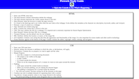

# Nayonna Purnell's Professional Portfolio

## Project Summary
Welcome, my name is Nayonna Purnell.  I am a Philadelphia, PA based full-stack JavaScript developer.  Below you will find a link to my current portfolio.  For easier access, you will also find a direct link to the repo for each project.  

## Projects

### Pre-Work

Check-out my GitHub Repo below!!!
https://github.com/nayonnapurnell/prework-study-guide

### Portfolio

Check-out my GitHub Repo below!!!
https://github.com/nayonnapurnell/Refactoring-HTML-CSS-for-Accessibility-and-SEO

### E-Commerce

Check-out my GitHub Repo below!!!
https://github.com/nayonnapurnell/dapperDudes

### Weather App

Check-out my GitHub Repo below!!!
https://github.com/nayonnapurnell/databasePractice

### Project Link
Here you can find the link to my deployed application:  https://nayonnapurnell.github.io/nPurnell-Portfolio-HW2/

### License
